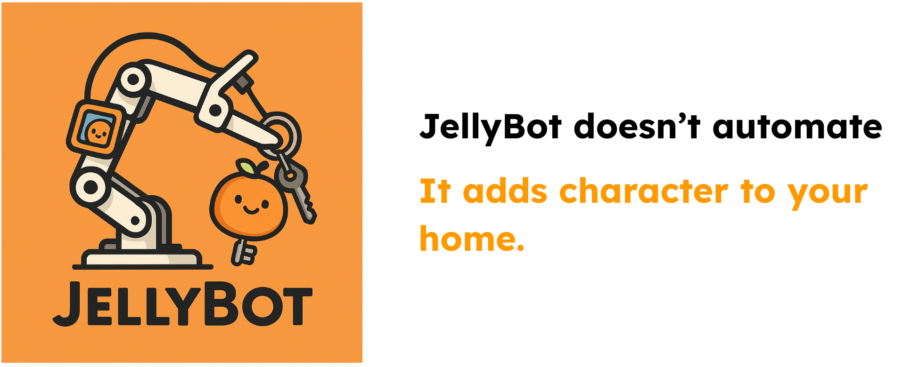

# 🧡 JellyBot: A Home-Aware Organizer Bot

JellyBot is a lightweight real-world robot that quietly helps you stay organized. Imagine coming home tired and dropping your keys — JellyBot picks them up and places them neatly back in the basket, without prompts or depth sensors. It runs on RGB-only vision using a fine-tuned version of SmolVLA.

---

## 🎥 Demo

<video src="jellybot_demo.mp4" controls width="600"></video>

> _Success rate: **~70%** under consistent lighting and camera setup._
---

## 🤖 Project Overview

- **Hardware**: 5-DoF LeRobot arm mounted on a hallway table  
- **Vision**: 3 RGB cameras (wrist, side, top-down)  
- **Model**: Fine-tuned [SmolVLA](https://arxiv.org/abs/2506.01844) on teleoperated human demos  
- **Training Setup**:  
  - GPU: RTX 4060 (8GB)  
  - Batch size: 16  
  - Steps: 2000  
  - Training time: ~2 hours  

Success rate reaches **~70%** under consistent lighting and camera setup.

---

## 🧠 Datasets

The following Hugging Face datasets were used for teleoperation-based training:

- 🎥 [record_test_give_keys](https://huggingface.co/datasets/islexu/record_test_give_keys)  
- 🍊 [record_test3_orange](https://huggingface.co/datasets/islexu/record_test3_orange)

---

## 🏋️‍♂️ Trained Models

JellyBot's SmolVLA models (RGB-only policy) are available here:

- [my_smolvla_h_b16s15000_give](https://huggingface.co/islexu/my_smolvla_h_b16s15000_give)  

---

## 📦 Features

- Vision-Language-Action model trained via imitation learning  
- RGB-only, no depth or privileged sensing  
- Real-world deployment on low-cost robot arm  
- Demo tasks: pick and place jellycat keychain

---

## 🧭 Future Outlook

JellyBot is just the start. The same setup can support:
- Handing sunscreen or sunglasses when leaving home
- Sorting child toy areas
- Emptying dishwashers or tidying kitchen counters

---

## ✨ Credits

Developed with ❤️ by [@islexu](https://huggingface.co/islexu)  
Built using [SmolVLA](https://github.com/huggingface/lerobot) and [LeRobot](https://github.com/huggingface/lerobot)

---

## 📩 Contact

For questions or collaborations, please open an issue or reach out on Hugging Face!

